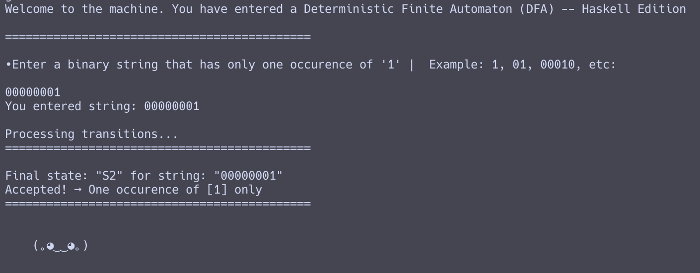
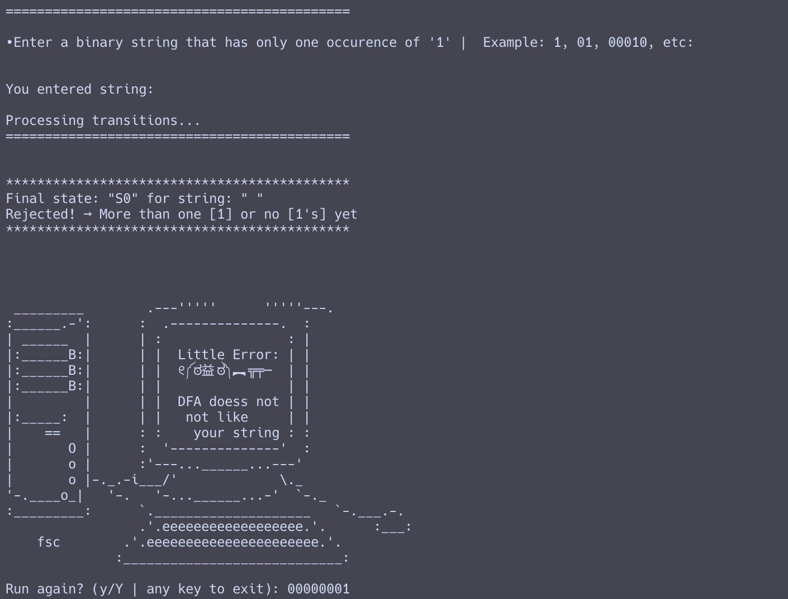
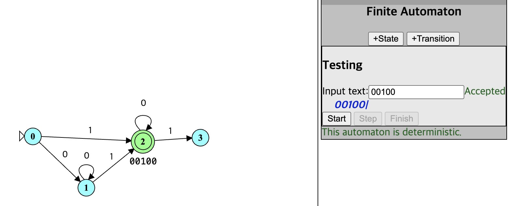
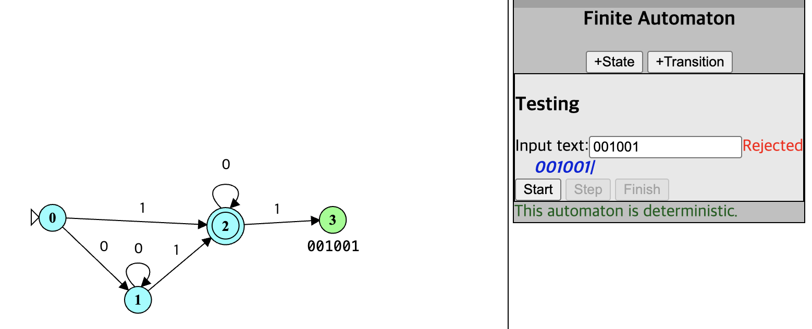

# Simple DFA in Haskell

A simple command-line Deterministic Finite Automaton (DFA) in Haskell that accepts binary strings containing exactly one '1'.

## Demo

### Accepted String (`00000001`)



### Rejected String (`111`)



### Transition Diagram (Accepts `00100`)



### Transition Diagram (Rejects `001001`)



## How to Run

### Option 1: Compile and Run

1.  **Compile:**
    ```sh
    ghc DFA.hs
    ```

2.  **Execute:**
    ```sh
    ./DFA
    ```

### Option 2: Run with GHCi

1.  **Load the file in GHCi:**
    ```sh
    ghci DFA.hs
    ```

2.  **Run the `main` function:**
    ```haskell
    *Main> main
    ```

The program will then prompt for input.

### Examples
-   `010` -> `Accepted`
-   `1` -> `Accepted`
-   `00110` -> `Rejected`
-   `000` -> `Rejected` 

## Functional Implementation Details

This DFA implementation showcases several core functional programming concepts available in Haskell:

*   **Algebraic Data Types (ADTs):** The possible states of the automaton (`S0`, `S1`, `S2`, `S3`) are modeled using an ADT:
    ```haskell
    data State = S0 | S1 | S2 | S3
    ```

*   **Pattern Matching:** The `transition` function uses pattern matching to define the state transitions for given states and input symbols. This provides a clear and declarative way to represent the DFA's logic.

    ```haskell
    transition :: State -> Symbol -> State
    transition S0 '0' = S1
    transition S0 '1' = S2
    -- ... and so on
    ```

*   **Recursion:** The `runDFA` function processes the input string recursively. It consumes one symbol at a time, calculates the next state, and calls itself with the new state and the rest of the string. This is a common and natural way to process lists in functional programming.

    ```haskell
    runDFA :: State -> [Symbol] -> State
    runDFA state [] = state 
    runDFA state (x:xs) = runDFA (transition state x) xs
    ```

*   **Purity:** The core logic of the DFA (`transition`, `runDFA`, and `isAccepted` functions) is pure. These functions do not have any side effects (like I/O) and their output depends only on their input. Side effects are managed separately in the `main` function, which is idiomatic Haskell. 